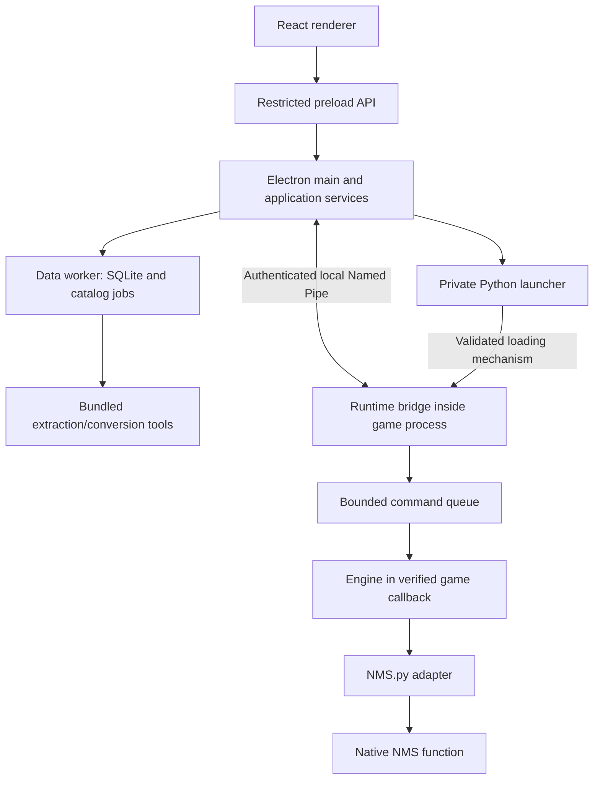

# Architecture and technology usage

Status: design specification. No application code exists yet.

## 1. Process model

The launcher and injected interpreter are distinct execution contexts. Packaging Python for the launcher alone is insufficient. Both must resolve the private interpreter, standard library, modules, native extensions, and DLL dependencies correctly.

Main owns application lifecycle. It does not own game state. The runtime is authoritative about readiness, execution context, target eligibility, and outcomes. SQLite stores application data, not an authoritative replica of game inventory.

## 2. Stack and how to use it

### Electron and electron-vite

Use Electron for window lifecycle, native dialogs, local resources, process coordination, and a controlled IPC boundary. Use electron-vite to build separate main, preload, and renderer entry points over Vite. Their output targets and dependencies must remain separate; a dependency imported into main must not accidentally enter the renderer bundle.

Production loads packaged resources through a restricted application protocol. Development uses Vite on loopback only. No Vite server ships in production. Register local asset handling with strict path mapping; do not turn a resource URL into arbitrary filesystem access.

Keep main startup small: establish paths, validate essential assets, acquire the application lock, open the window, register handlers, and asynchronously start data/status services. A catalog scan or Python readiness check must not delay the initial window unnecessarily.

### React, routing, and TypeScript

Use React for screen composition and controlled interaction state. Use React Router with hash routing initially so navigation does not require an HTTP server or custom deep-path fallback. Lazy-load future large feature pages.

Enable TypeScript strict mode. Define domain types in their owning package; distinguish wire DTOs, persistent records, and UI view models. Do not use one giant type with optional fields for every entity. Use discriminated unions for command types and result states.

Avoid unnecessary any, circular dependencies, broad index re-exports, and importing server modules from renderer code. Narrow unknown inputs after runtime validation.

### shadcn/ui, Tailwind, and Lucide

Use the installed skill and MCP. Start with official @shadcn components, a single official preset, and its matching primitive base. Pin the resulting setup in components.json. Do not mix Base UI and Radix APIs.

Tailwind handles layout, spacing, and semantic tokens. It does not become a custom theme layer. Preserve standard component colors, type, radius, shadows, focus, and animation. Configure Lucide explicitly. Use official component compositions rather than hand-built equivalents.

The registry inspected earlier exposed a Radix Sidebar while the current web page redirected to Base UI. Resolve this deliberately during M0; do not infer a base from a single example. Prefer the official default preset at initialization, record it, and keep it stable.

### Zustand

Use small stores for connection snapshots, capability availability, selected target, catalog filter preferences, and UI preferences. Use selectors to avoid rerendering entire screens on one status event.

Do not store thousands of full catalog records, binary icons, SQLite connections, native pointers, or mutable game objects in Zustand. Forms own their drafts. Search results belong to query hooks with cancellation/stale-response protection. Persist user preferences via the application service, not unrestricted renderer filesystem access.

No extra query-state library is required for M0. Add one only if measured application complexity justifies it; do not introduce overlapping sources of truth.

### Zod and cross-language contracts

Zod validates preload requests, responses, and protocol payloads on the TypeScript side. Validation at main is mandatory even if the renderer already validated a form.

Use a documented wire specification with language-neutral fixtures. TypeScript schemas and Python parsers must pass the same valid/invalid cases. If generating JSON Schema, verify that transformations, integer bounds, and discriminated unions preserve wire semantics. Generated schemas do not automatically translate all runtime behavior.

The initial Python implementation can use typed dataclasses and explicit boundary validators. Add a separate validation library only if it reduces real duplication without compromising packaging. Python hints alone are not validation.

### SQLite and better-sqlite3

Use SQLite locally without a database server. The initial driver candidate is better-sqlite3; it is a native dependency and requires an Electron-compatible build. [Upstream driver](https://github.com/WiseLibs/better-sqlite3), [Electron native modules](https://www.electronjs.org/docs/latest/tutorial/using-native-node-modules).

The driver is synchronous, so run database work in a dedicated Electron utility process/data worker. Expose typed requests and bounded result pages. Keep one owner for writes. No database connection reaches the renderer or game hook.

Use SQL migrations and small repositories first; no ORM is needed to model this initial schema. Bind parameters; keep long extraction transactions out of latency-sensitive queries. Worker exit and recovery must preserve transaction guarantees and mark interrupted jobs accurately.

### Python, pyMHF, and NMS.py

Python hosts the runtime integration. pyMHF handles supported loading/hooking mechanisms; NMS.py supplies known game bindings. Our adapter encapsulates them. Engines express product operations using our vocabulary.

Use uv only for development/build dependency resolution and repeatable preparation. End users run a private packaged interpreter. Initial candidate: ordinary CPython 3.11.9 x64, because the currently documented NMSpy support range is Python 3.9–3.11 and pyrun-injected 0.2.0 has a matching wheel; this is not a full dependency compatibility result.

No arbitrary code execution method is exposed by our bridge. Upstream terminal/API infrastructure must be audited and disabled or removed in the distributed integration; see DISTRIBUTION.md.

### Packaging and quality tools

Use electron-builder as the packaging candidate: a Windows x64 ZIP and an offline per-user NSIS installer built from the same verified payload. Neither is a web installer. Native tools and Python live outside app.asar.

Use ESLint, TypeScript checks, Vitest, React Testing Library, and Playwright for appropriate JavaScript/application checks. Use pytest, Ruff, and mypy for Python. Pin compatible versions when their milestones begin. No compiler, test runner, or package manager is a runtime prerequisite for end users.

## 3. Application services

| Service | Inputs | Outputs / responsibilities |
| --- | --- | --- |
| ApplicationLifecycle | Launch/close events | Single instance, child lifecycle, graceful shutdown |
| InstallationService | Detection hints or chosen path | Validated installation identity; no disk-wide scan |
| GameStatusService | Process observations | Instance identity, executable/build observations |
| RuntimeHostService | Validated runtime bundle and game instance | Controlled startup; readiness and diagnostic state |
| BridgeClient | Typed protocol commands | Handshake, session events, request tracking |
| DeliveryService | Validated user intent | Journal entry, capability precheck, dispatch, outcome mapping |
| CatalogService | Query or extraction job request | Pages, progress, generation state |
| PreferencesService | Narrow preference changes | Validated persisted preferences |
| HistoryService | Filters/retention actions | Sanitized history pages and explicit cleanup |
| DiagnosticsService | User request | Local redacted report and log-folder actions |

Services are injected through an explicit composition root. Avoid a service locator accessible everywhere. Main builds real adapters; tests inject bounded fakes. Renderer imports only public contracts.

## 4. Security boundaries

- nodeIntegration disabled; contextIsolation enabled; renderer sandbox enabled by default.
- Preload exposes a frozen set of named methods and subscriptions, with unsubscribe support.
- No raw ipcRenderer, require, fs, shell, child_process, native handles, or game pointers in renderer APIs.
- Main validates IPC origin/frame and payload; runtime revalidates authorization and context.
- Restrictive production CSP, local resources, blocked unexpected navigation/windows/permissions.
- External links require an explicit user action and approved URL policy.
- Runtime bootstrap loads only our approved modules, not arbitrary installed mods or writable user plugin folders.
- Store no secrets in renderer-accessible local storage or verbose protocol logs.
- Unknown game versions fail closed for mutations. Developer mode does not bypass this.

These follow Electron's documented security boundaries; implementation must verify actual behavior in the packaged app. [Electron security](https://www.electronjs.org/docs/latest/tutorial/security).

## 5. Event flow and lifecycle

Status subscriptions deliver snapshots/events into narrowly scoped stores. Include session identity and sequence to reject stale data. Reconnection fetches a fresh snapshot before enabling actions.

Loading a save, returning to the menu, changing session, or restarting the game invalidates old game references and pending intents. Recheck readiness at execution time. Never keep a raw pointer solely because it was valid when the UI was clicked.

On application close: stop accepting work, cancel unstarted commands where possible, close subscriptions, flush application logs, and stop owned out-of-process workers. Do not terminate the game. Do not forcibly unload an injected interpreter or hook still in use. The current diagnostics path blocks window close while its host is active and requires the game to close first; this is a conservative lifecycle guard, not proof of safe hook unloading. Installation replacement/removal must account for loaded DLLs.

## 6. Performance budgets

These are proposed targets, not measured results. Record hardware and release configuration before enforcing them.

| Area | Initial target / policy |
| --- | --- |
| Warm catalog startup | Usable window within 2 seconds on reference hardware; cold/warm measured separately |
| Indexed search | p95 under 100 ms excluding deliberate input debounce |
| User feedback | Pending feedback on next render cycle, ideally under 100 ms |
| Idle status | Event-driven updates; bounded slow process detection, no busy loops |
| Catalog UI | Paged results, thumbnail limits, lazy image decoding |
| Runtime queue | Short measured work budget per verified callback; no disk/network I/O there |
| Extraction | Background worker, bounded concurrency, progress, safe cancellation |
| Memory | Establish a baseline before setting a hard limit; no full icon/catalog duplication |

Measure frame-time p95/p99 with and without the bridge. A time budget cannot preempt a long native function, so measure individual calls and reject unsuitable execution strategies. Do not promise delivery latency or negligible game impact before evidence. [Electron performance](https://www.electronjs.org/docs/latest/tutorial/performance).

## 7. Dependency rules

Renderer → public contracts and UI-domain helpers only. Main → application services → adapters. Worker → catalog/persistence/tool adapters. Runtime engines → game adapter interfaces. NMS.py imports remain inside runtime adapters/bootstrap.

No React dependencies in protocol/catalog/persistence packages. No Electron imports in pure domain/schema modules. No database/filesystem operations inside game callbacks. No runtime save-writing path.

Future Save Editor → save-domain interfaces → save-format adapters and file-application service. Shared library definitions must declare separate runtime-delivery and save-editing support.
